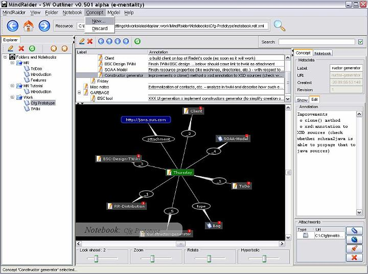

# History <!-- Metadata: type: Outline; created: 2018-02-23 10:56:27; reads: 188; read: 2020-04-19 20:25:18; revision: 188; modified: 2020-04-19 20:25:18; importance: 1/5; urgency: 1/5; -->
[Donald Knuth](https://cs.wikipedia.org/wiki/Donald_Ervin_Knuth) implemented [TeX](https://en.wikipedia.org/wiki/TeX) because he was not satified with existing typesetting systems and he wanted to write beautiful research articles and books.

[Linux Torvalds](https://en.wikipedia.org/wiki/Linus_Torvalds) implemented [Git](https://en.wikipedia.org/wiki/Git) because he was not satisfied with existing version-control systems and he wanted to efficiently maintain
Linux kernel source code.

I admire both of these men. Both of them stopped the work and implemented tool which they were
desperately missing. Then they returned back to do what they know best. My motivation is exactly the same.

[I](http://me.mindforger.com/) implemented MindForger because I was not satisfied with existing knowledge
management tools and I want to learn exciting things for the rest of my life.

Forger part of MindForger name is inspired by _forger_ character from [Inception](https://www.imdb.com/title/tt1375666/fullcredits) movie by Christopher Nolan (Tom Hardy as dream property forger). This is also why the first release 
title screenshot has been based on Eddie character from [Venom](https://www.imdb.com/title/tt1270797/) movie 
(Tom Hardy w/ symbiont).

[MindForger](https://www.mindforger.com) is my fourth attempt to implement a good knowledge management
tool. Therefore it has relatively long history - it is successor of
[RDF Spiders](#rdf-spiders), [MindRaider](#mindraider) and [Coaching Notebook](#coaching-notebook). Actually it's a bit more 
complicated...
# RDF Spiders <!-- Metadata: type: Note; created: 2018-03-18 09:12:54; reads: 43; read: 2020-04-19 20:24:29; revision: 36; modified: 2018-05-10 12:48:36; -->

[RDF Spiders](http://mindraider.sourceforge.net/gallery/mindraider-incubator/index.html) was 
a 90s Java-based application which visualized RDF models. RDF was a core format specification
of the Semantic Web. 

RDF Spiders can be seen as a **mind mapping** application with native 
RDF runtime interoperable with other Semantic Web applications.
It required good knowledge of RDF which limited 
number of potential users. This is why I decided to implement more user friendly 
[MindRaider](#mindraider).
# MindRaider <!-- Metadata: type: Note; created: 2018-03-18 09:12:59; reads: 21; read: 2020-04-19 20:25:18; revision: 5; modified: 2020-04-19 20:25:18; -->

[MindRaider](http://mindraider.sourceforge.net/) is a 90s Java-based 
Semantic Web desktop application ([video](https://www.youtube.com/watch?v=Q95ixrVCXEs)) which is an outliner with RDF runtime. 
MindRaider was decently successful project with 100.000+ downloads. However 
it became morally obsolete and I didn't want to invest my time to deliver new features 
on top of dying UI and runtime technology. Therefore I decided to start a new project.
# Coaching Notebook <!-- Metadata: type: Note; created: 2018-03-18 09:13:06; reads: 13; read: 2018-03-18 09:19:34; revision: 8; modified: 2018-03-18 09:19:34; -->

[CoachingNotebook](http://web.mindforger.com/) is a successor of MindRaider. 
At the beginning it was a combination of auto-coaching tool and outliner.
Implemented on Google App Engine PaaS (GAE) it served as a way to learn trendy
technologies. After a few years I determined
that coaching aspect of MindForger has questionable future, application is too big,
complex and basically all coaching features can be realized using a mature outliner.

Therefore I decided to split CoachingNotebook project to two focused applications:
auto-coaching and outliner. I opensourced CoachingNotebook (w/o outliner) 
on [GitHub](https://github.com/dvorka/coaching-notebook) under Apache license.

Then I decided to return back to the roots.
# MindForger <!-- Metadata: type: Note; tags: cool; created: 2018-03-18 09:14:07; reads: 8; read: 2018-10-10 18:12:20; revision: 5; modified: 2018-05-10 12:51:32; -->

[MindForger](https://github.com/dvorka/mindforger) is desktop
application built with lessons learned/fails/experience from all my past projects. 
It aims to finally go beyond outliner and become definitive human mind inspired *personal* knowledge management 
tool running on desktop. Key features include human mind like capabilities, security, sharing and good overall performance.
